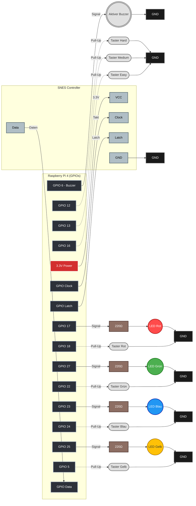

# Simon Says - Schaltplan (Mermaid)

Hier ist der aufgeräumte, gut strukturierte Schaltplan, der das "cursed" Kabelgewirr vermeidet. Der Trick besteht darin, die Signalflüsse konsequent von links (Raspberry Pi) nach rechts (Komponenten & Masse) fließen zu lassen und individuelle Masse-Symbole (GND) zu verwenden, um lange, kreuzende Linien zu verhindern.

