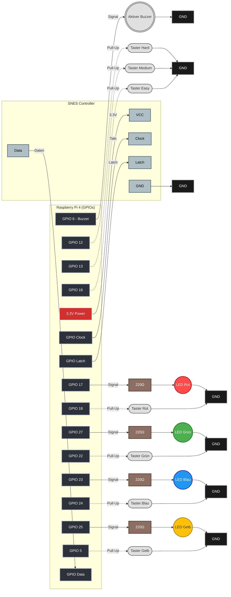
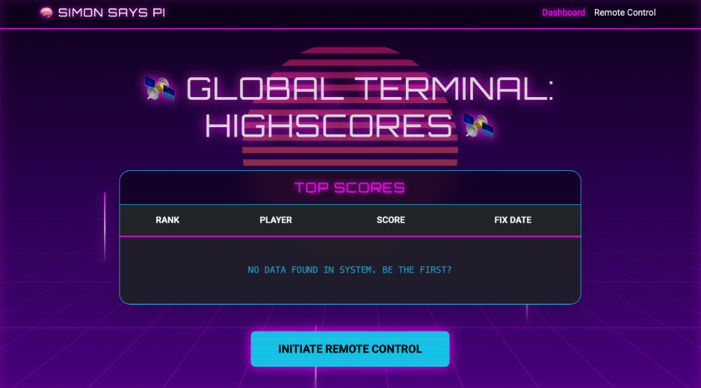
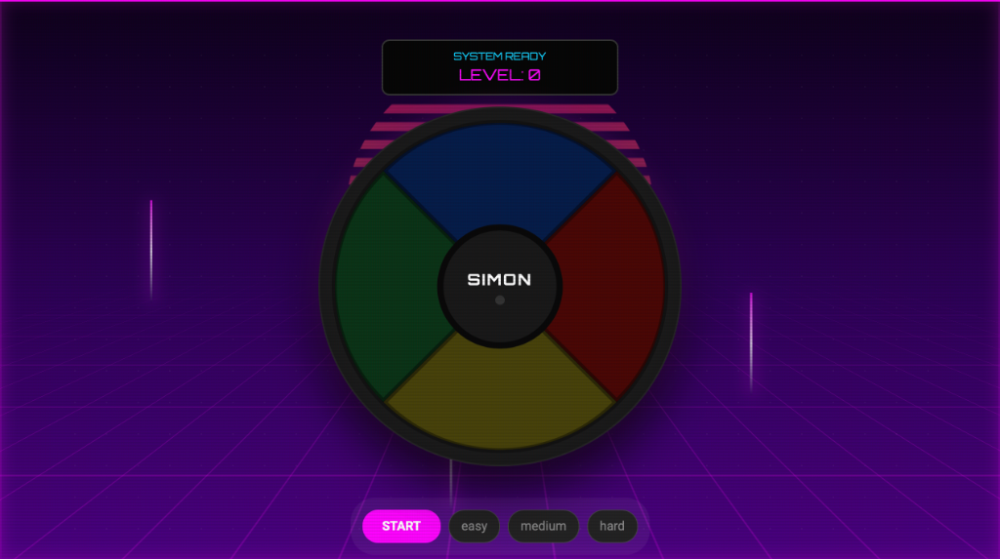

# Dokumentation: Raspberry Pi Simon Says (Cyber-Physical System)

## 1. Projektübersicht
Dieses Schulprojekt im Fachbereich Informatik/Technik realisiert das klassische "Simon Says" Gedächtnisspiel und demonstriert dabei die Prinzipien eines **Cyber-Physical Systems (CPS)**. Ein Raspberry Pi 4B steuert als zentrale Verarbeitungseinheit vier LEDs (Aktoren) und registriert Eingaben über Taster sowie einen SNES Controller (Sensoren). Ziel ist es, eine zufällig generierte und immer länger werdende Sequenz von Lichtsignalen fehlerfrei zu wiederholen. Ein aktiver Buzzer gibt akustisches Feedback zum Spielstatus. Durch die Integration einer Web-Oberfläche wird das lokale Hardware-System zu einem vollständig vernetzten IoT/CPS-Ökosystem erweitert.

## 2. Hardware-Komponenten (Physische Schnittstellen)

- **Zentraleinheit**: Raspberry Pi 4 Model B 
- **Eingabe (Sensoren)**: 
  - 4x Push-Button (Spiel-Taster: Rot, Grün, Blau, Gelb)
  - 3x Push-Button (Schwierigkeitsgrad: Easy, Medium, Hard)
  - 1x SNES Controller (Erweiterte Eingabeschnittstelle über Schieberegister-Protokoll)
- **Ausgabe (Aktoren)**: 
  - 4x LED (Optisch: Rot, Grün, Blau, Gelb)
  - 1x Aktiver Buzzer (Akustisches Feedback)
- **Elektronik**: 4x 220 $\Omega$ Vorwiderstände (für LEDs), Jumper-Kabel und Breadboard.

## 3. Anschlussplan (GPIO Belegung)

Die Software nutzt die BCM-Nummerierung. Die Taster sind gegen GND geschaltet (interner Pull-Up aktiviert).


| Farbe / Typ | Komponente | BCM Pin | Physischer Pin |
| --- | --- | --- | --- |
| Rot | LED | 17 | Pin 11 |
| Rot | Button | 18 | Pin 12 |
| Grün | LED | 27 | Pin 13 |
| Grün | Button | 22 | Pin 15 |
| Blau | LED | 23 | Pin 16 |
| Blau | Button | 24 | Pin 18 |
| Gelb | LED | 25 | Pin 22 |
| Gelb | Button | 5 | Pin 29 |
| Sound | Buzzer | 6 | Pin 31 |
| Masse | Common GND | - | "z.B. Pin 6, 9, 14" |

<div style="page-break-after: always;"></div>

### Schaltplan (Mermaid)

Der Signalfluss fließt konsequent von der Logikeinheit (links) zu den Aktoren/Sensoren und endet an der Masse (rechts).




## 4. Software-Architektur
### Dateistruktur

`Config.py`: Enthält die Pin-Konfiguration und Hardware-Zuweisung.

`SimonSay.py`: Beinhaltet die gesamte Spiellogik, Klassenstruktur und Hardware-Interaktion via gpiozero.

`Dockerfile` / `docker-compose.yml`: Ermöglicht den Betrieb in einer isolierten Container-Umgebung auf Debian-Basis.

### Spiel-Ablauf & Signale
****Bereitschaft (Idle)****: Eine "Wellen-Animation" läuft dauerhaft über die LEDs, bis ein beliebiger Knopf gedrückt wird.

****Simon-Phase****: Simon fügt der Sequenz eine neue Farbe hinzu und spielt diese ab. Der Buzzer piept 1x zur Einleitung.

****Spieler-Phase****: Der Buzzer piept 2x schnell. Der Spieler muss die Sequenz wiederholen.

****Game Over****: Bei falscher Eingabe blinken alle LEDs und der Buzzer piept 3x langsam. Danach kehrt das Programm zur Bereitschafts-Welle zurück.


<div style="page-break-after: always;"></div>

## 5. Deployment via Docker

Das Projekt ist für den Betrieb unter ****Debian 13 (Trixie)**** mit ****Kernel 6.12**** optimiert.

#### Voraussetzungen

- Docker & Docker Compose installiert.

- lgpio Bibliothek im Container für modernen Kernel-Zugriff.

```bash
# Bauen und Starten im Hintergrund
docker compose up -d --build

# Logs einsehen (um Spielanweisungen zu lesen)
docker compose logs -f
```

## 6. Sicherheitshinweise

- ****Widerstände****: Betreibe LEDs niemals ohne Vorwiderstand am Pi 4B, um die GPIO-Ports zu schützen.

- ****GND****: Achte darauf, dass alle Buttons und LED-Kathoden eine saubere Verbindung zur gemeinsamen Masse (GND) haben.

- ****Case Sensitivity****: Unter Linux muss die Konfigurationsdatei strikt kleingeschrieben als config.py vorliegen, damit der Import im Docker-Container funktioniert.


<<<<<<< HEAD
****Projekt von****: ***Sebastian Scholtysek, Robin Zindler, Lars Krümmel***
## 7. Die Web-Oberfläche (Netzwerk-Komponente des CPS)

Um das Projekt zu einem vollwertigen Cyber-Physical System zu erweitern, wurde das lokale Hardware-Setup um eine vernetzte Komponente ergänzt. Eine in Python (Flask) geschriebene Web-Applikation (`app/`) dient als digitale Schnittstelle und verknüpft die physischen Sensoren und Aktoren des Raspberry Pi mit einem netzwerkbasierten Dashboard.

### Funktionen der Web-App

1. **Dashboard & Datenpersistenz (Highscores)**:
    Die gesammelten Spieldaten werden in einer lokalen SQLite-Datenbank (`simon.db`) persistent gespeichert. Sobald ein "Game Over" auf der Hardware registriert wird, kann der Nutzer seinen Namen im Web-Interface eintragen. Das Dashboard ruft diese Daten ab und präsentiert eine interaktive Top-10-Bestenliste. Dies demonstriert die Integration von physischen Ereignissen mit klassischer Software-Datenhaltung.
    
    

2. **Remote Control & Bidirektionale Echtzeit-Synchronisation**:
    Das Herzstück der Netzwerkintegration ist die Remote-Control-Ansicht, die über WebSockets eine latenzarme, bidirektionale Kommunikation ermöglicht:
    - **Beobachten (Digitaler Zwilling)**: Die Zustände der physischen Hardware werden in Echtzeit in den Browser gespiegelt. Leuchtet eine LED am Steckbrett auf, wird dies simultan auf der Weboberfläche visualisiert.
    - **Steuern (Fernzugriff)**: Das System kann vollständig über den Browser bedient werden. Ein Klick auf die virtuellen farbigen Taster löst exakt denselben Logik-Trigger aus wie ein physischer Knopfdruck am Breadboard.
    - **Schwierigkeitswahl**: Über Buttons (Easy, Medium, Hard) lässt sich die Spielgeschwindigkeit dynamisch zur Laufzeit anpassen, was direkte Auswirkungen auf die Blink- und Pausendauern der physischen LEDs hat.

    

### Schwierigkeitsstufen

Das Spiel bietet drei Schwierigkeitsgrade, die Geschwindigkeit und Pausen beeinflussen:

| Stufe | Blink-Dauer | Pause zwischen Signalen | Beschreibung |
| :--- | :--- | :--- | :--- |
| **Easy** | 0.8s | 0.5s | Langsam und entspannt. Gut zum Einstieg. |
| **Medium** | 0.5s | 0.3s | Standard-Geschwindigkeit. Ausgewogen. |
| **Hard** | 0.2s | 0.1s | Sehr schnell. Nur für Experten! |

Die Schwierigkeit kann über die **Web-Oberfläche (Remote)** oder über dedizierte **Hardware-Buttons** (GPIO 12, 13, 16) eingestellt werden.

 